# NGUYỄN ĐẶNG TRƯỜNG AN

<!--  -->

<!--  -->

<!--  -->

<!--  -->

<!--  -->
<!--  -->
<!--  -->

    <!-- Frontend / Web UI -->
    
    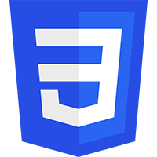
    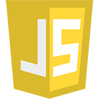
    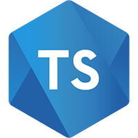
    
    
    
    
    
    <!-- Backend / App Frameworks -->
    
    
    
    
    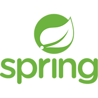
    
    
    
    
    
    <!-- Programming Languages -->
    
    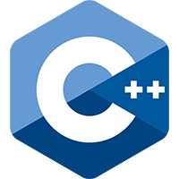
    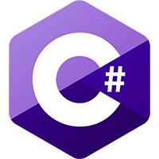
    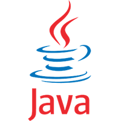
    
    
    
    
    
    
    
    <!-- Mobile / Cross-platform -->
    
    
    
    
    <!-- Database / Storage / Search -->
    
    
    
    
    
    
    
    
    
    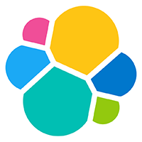
    
    
    
    <!-- Messaging / Workflow Automation -->
    
    
    <!-- AI / ML / Data Science -->
    
    
    
    
    
    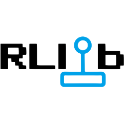
    
    
    
    
    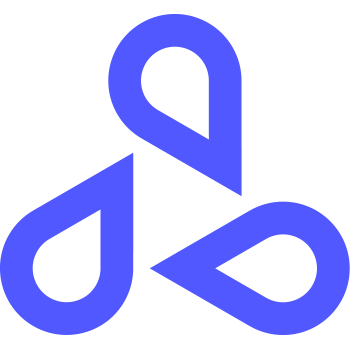
    
    
    
    
    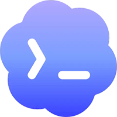
    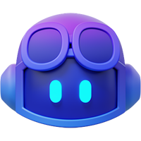
    
    <!-- DevOps / Containers / Orchestration -->
    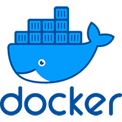
    
    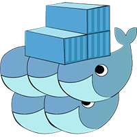
    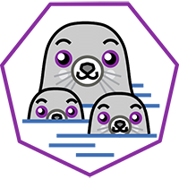
    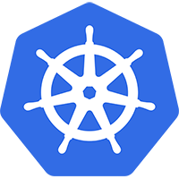
    
    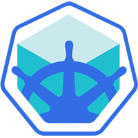
    
    
    
    
    
    
    
    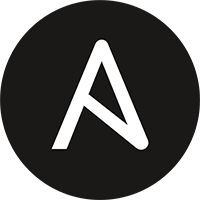
    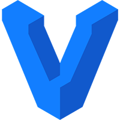
    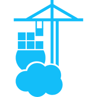
    
    <!-- Observability / Security / Networking -->
    
    
    
    
    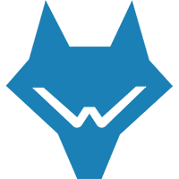
    
    
    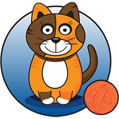
    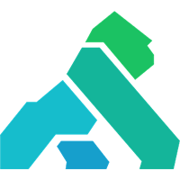
    
    
    
    
    
    
    <!-- Source Control / Package Management / Collaboration -->
    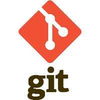
    
    
    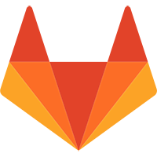
    
    
    
    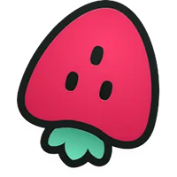
    <!-- Cloud / Hosting -->
    
    
    
    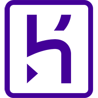
    <!-- Game / 3D / Creative Tools -->
    
    
    
    
    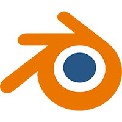
    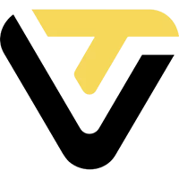
    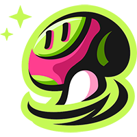
    
    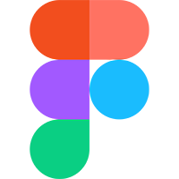
    
    <!-- Industrial / Specialized -->
    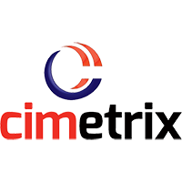

